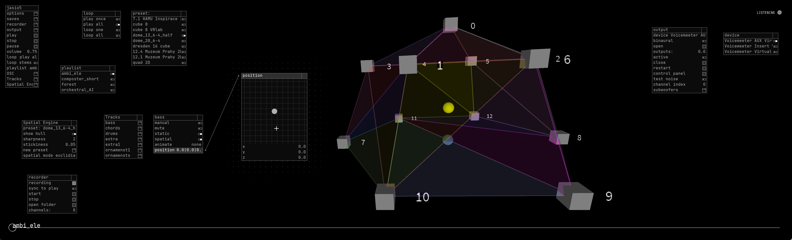

# Trick the Ear Audio Engine (TEA-E) - Spatial Audio Engine

## What is this good for?
The App is a spatial audio engine and audio mixer all in one. You have multiple speakers, and you want to create an illusion that the sound is moving between them. It can also render spatial audio into binaural stereo for headphones monitoring. Furthermore, it also serves as an audio recorder. You can set virtual audio sources' position manually, select from premade animations, or use OSC or TUIO API to animate their positions from other software of your choosing. 

## How to use it?
* Place your .wav mono audio files in `data/samples/your-playlist-name` folder (it can be a single track or multiple, they will all be played in sync).
* Create a speaker preset in `JSON` format (see examples in `data/speaker_presets`), specify a name for the preset, where your speakers are, the channel number, and whether it is a subwoofer or a regular speaker.
* Run the software, it will automatically load all your playlists from `data/samples/` and your speaker presets from `data/speaker_presets`. In the GUI, select which preset and playlist you want.
* In the GUI, click `output` and select the ASIO device you want to use. Click `open`. If you're going to test on headphones only, toggle the `binaural` option.
* Now you are connected to the given ASIO device, and you may click `play`.  
* In the GUI, click `Tracks`, `Name of your track`, and you will see a bunch of options. Make sure that `spatial` & `static` are set to true. Adjust the `position` of each audio File in space - you can increase or decrease the precision of the slider by using the mouse scroll wheel. 

[](https://www.youtube.com/watch?v=s-aY4L8xGKc)

## Download
* [Latest release](https://github.com/trackme518/trick-the-ear-spatial-audio-engine/releases)

MacOS and Linux builds will be added later.

Download links provide a zipped archive with the tool. You don't need to install anything - unzip it and run the ".exe" file.

## To be done - Features wanted
* Video tutorial + templates how to connect via OSC (coming soon)
* Minor bug fixes
* Test and fix if needed the MacOS audio interface -> create new release
* Add Linux audio interface
* Add more animation types
* Optimize performance (aka make it faster)
* Add support for loading subwoofers automatically from preset
* Let user set binaural output channels manually
* Add visualization for circular animation trajectories

## Speakers preset
Place your speaker preset in `.JSON` format inside the `data/speaker_presets` folder. 
```JSON
{
  "name": "My preset 8.1 Cube",
  "speakers":[
  {"index":6, "position_normalized":[1, 0.5, 1]},
  {"index":7, "position_normalized":[1, 0.5, -1]},
  {"index":1, "position_normalized":[-1, -0.5, 1]},
  {"index":2, "position_normalized":[1, -0.5, 1]},
  {"index":0, "position_normalized":[-1, -0.5, -1]},
  {"index":5, "position_normalized":[-1, 0.5, 1]},
  {"index":3, "position_normalized":[1, -0.5, -1]},
  {"index":4, "position_normalized":[-1, 0.5, -1]}
  {"index":8, "position_normalized":[0, 0, 0],"lfe": true}
  ]
}
```
* "name": String - name your preset (arbitrary, but it should be unique)
* "index": Integer - channel index (depends on your physical connection from your sound card - ie, how you wired the speakers)
* "position_normalized": Vector - position in range 0-1 x (left to right),y (front, rear),z (height). If you set all z coordinates to 0.0 it means this is a 2D layout.
*  "lfe": Boolean - Mark true if the speaker is a subwoofer (low-frequency effects). Then it will not be used for spatial audio, but rather all other channels get a low-pass filter, which will be optionally sent to this speaker to produce bass. This is an optional parameter; if not present, the software assumes it is set to false (regular speaker).    

## OSC
The App supports the Open Sound Control protocol. You can send positions of the virtual audio sources from other software, like so:

| OSCaddress | typetag |  Track ID | x | y | z |
| ---------- | ------- | ---- |----- |----- |----- |
|/position | ifff | 0 (1st track) | 0.0 | 0.368 | 1.0 |

You can also directly set individual gains for each track and channel (effectively using the App as an audio mixer only). Send as many gain values as you have speakers. 

| OSCaddress | typetag |  Track ID | 1st speaker channel | gain [0-1] | 2nd speaker channel | gain [0-1] |
| ---------- | ------- | ---- |----- |----- |----- |----- |
|/gains | iifififif... | 0 (1st track) | 5 | 0.368 | 1 | 0.98 |

## TUIO
The App supports TUIO protocol (part of reacTIVision by Martin Kaltenbrunner). See below current implementation. Whenever the marker is moved its positions is assigned to Track based on marker ID (so marker ID 0 == 1st Track). You can download a [simulator](https://reactivision.sourceforge.net/#files), that lets you move the virtual markers around and see the virtual sources move in the App. 
```
// called when a marker is moved
void updateTuioObject (TuioObject tobj) {
  int index = tobj.getSymbolID();
  PVector currPos = new PVector( (tobj.getX()*2.0f)-1.0f, (tobj.getY()*2.0f)-1.0f, 0 ); //tobj.getAngle() not used
  Track currTrack = playlists.playlist.getTrack(index);
  if (currTrack==null) {
    return;
  }
  //println(currPos);
  currTrack.setPosition(currPos);
  //---------------------------------------------------------
}
```
## Why was it created?
The App is a culmination of PhD and personal research into spatial audio. It allowed me to precisely manipulate each individual parameter (not possible with proprietary closed software) and helped me understand how the spatial audio is actually created. It powered art performances and scientific experiments alike. More importantly, it allowed me to explore new ways to diffuse sound in space.   

## How does it work?
Under the hood, the tool is programmed in Processing Java. It uses VBAP - Vector-based amplitude panning for calculating individual speaker gains for each audio track, either in 2D or 3D. It also uses custom HRTF - Head related transfer functions and spherical harmonics interpolation for calculating binaural audio  (spatial audio for stereo headphones).   

## How to build from source?
Download [Processing](https://processing.org/) (originally made with version 4.3.4), download dependencies (see list of libraries below). Open the source and select File ->Export Application to build for your platform. Processing supports Windows, Linux, Apple, and Android; functionality depends on your hardware, and some changes might be needed. Read more at [Processing documentation](https://processing.org/environment/#export).  

### Libraries used
* [OSCP5](https://github.com/sojamo/oscp5) - Open Sound Control protocol API
* [LazyGui](https://github.com/KrabCode/LazyGui) - GUI package
* [TUIO](https://github.com/mkalten/TUIO11_Processing) TUIO protocol API
* [jHDF](https://github.com/jamesmudd/jhdf) Loading HDF files (.sofa)
* [Jasio host](https://github.com/mhroth/jasiohost) - ASIO SDK (Windows) - tested, works
* [JCoreAudio](https://github.com/mhroth/JCoreAudio/tree/master) CoreAudio SDK (MacOS) - untested
* [jnajack](https://github.com/jaudiolibs/jnajack) - Linux Audio SDK, untested (probably does not work)

### Windows
Tested on Windows 11. It should work out of the box. Just double-click the ".exe" file. If you are using an antivirus such as Windows Defender, it will show a warning - you can safely click "More info" and choose "Run anyway". Next time it should run without warning. Allow the program in your firewall for both private and public connections.

## Acknowledgments
Special thank you to:
* [Pavel Husa](https://github.com/pavelhusa) for consultation
* [Tangible Audio Lab in Linz](https://tamlab.kunstuni-linz.at/) for inspiration
* [Prof. Dr.-Ing. Dietrich Kammer](https://dkammer.org/) and SYNC!D team for an opporutnity to work on mobile audio container lab in Dresden
* [Univ.-Prof. Dr. Martin Kaltenbrunner](https://tamlab.kunstuni-linz.at/team/martin-kaltenbrunner/) for consultation and TUIO protocol suite
* [Ass.-Prof. Dr. Enrique Tomás](https://tamlab.kunstuni-linz.at/team/enrique-tomas/) for consultation
* Jimmy Orawetz for testing

## Cite
Please always link back to this repository. I am waiting for the associated white paper to be published at Springer...TBD

BibTex:
```
```

## License
©2025 Vojtech Leischner 

Creative Commons Attribution-NonCommercial-ShareAlike 4.0 International (CC BY-NC-SA 4.0). When using or distributing the code, give credit in the form of "Trick the Ear Audio Engine (TEA-E) software (https://github.com/trackme518/trick-the-ear-spatial-audio-engine) by Vojtech Leischner (https://trackmeifyoucan.com)". Please refer to the [license](https://creativecommons.org/licenses/by-nc-sa/4.0/). The author is not liable for any damage caused by the software. Usage of the software is completely at your own risk. For commercial licensing, please [contact](https://tricktheear.eu/contact/) us.   
